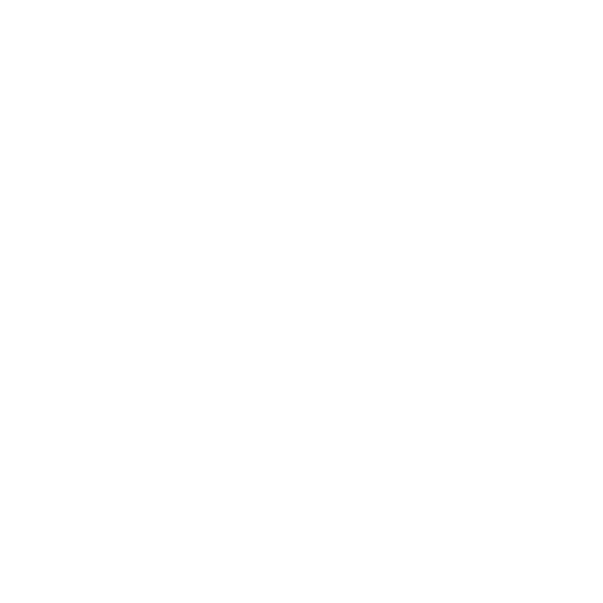

  

<h3 align="center">I'm a mastery student at School42 (currently doing an internship), previously concept / 3D artist and hobby electronic music production ethusiast.</h3>

### 🔧 &nbsp;My Toolbox

  <a href="https://skillicons.dev">
    
Programming Languages:

    
    
Markup Languages:

    
    
Frameworks and Tools:

    
    
Systems and Software:

    
  </a>

### 📚 &nbsp;Notable Academic Projects

Some stuff I've done as a student I am proud of.
- [ft_transcendence (42)](https://github.com/kixikCodes/ft_transcendence): A full-stack web application featuring online tournaments, player dashboards and much more.
- [miniRT (42)](https://github.com/kixikCodes/miniRT): A simple 3D raytracer in C using the MLX42 graphics library.
- [Webserv (42)](https://github.com/kixikCodes/webserv): A basic HTTP server in C++ with non-blocking I/O and an example website for hosting.

### 🧪 &nbsp;Notable Personal Projects

Some of my own project ideas.
- Project Abiogenesis (in early concept stage): My passion project.
- [Rummikool](https://github.com/KixiKcodes/Rummikool): A CLI Rummikub solver algorithm that uses some wacky math and dymanic programming.
- [Grimoire](https://github.com/KixiKcodes/Grimoire) (Work in Progress): My app for setting up _Blood on the Clocktower_ games easily.
- [BotC Gamemaster](https://github.com/kixikCodes/BOTC_Gamemaster): The predecessor to Grimoire. A CLI application for setting up _Blood on the Clocktower_ games.
- [traSH](https://github.com/KixiKcodes/traSH): A fully functional bash-like shell writen in C, instpired by the _minishell_ project from 42.

### 📊 &nbsp;Profile Statistics

